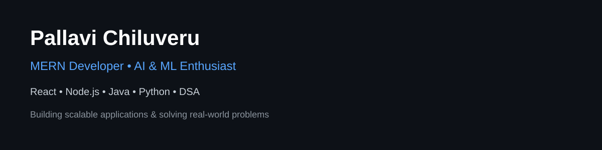

  

  
   
  

# 💫 About Me:

🚀 Passionate about building scalable full-stack applications with the MERN stack and solving complex problems through Data Structures & Algorithms.

🤝 Excited to collaborate on impactful projects in Web Development, Artificial Intelligence, and Machine Learning.

📚 Continuously learning and exploring DSA, Backend Development, Machine Learning, and Generative AI technologies.

💡 Interested in creating technology-driven solutions that deliver real-world value and meaningful user experiences.

💬 Ask me about MERN Stack, Python, Java, DSA, and AI/ML fundamentals.

⚡ Outside of tech, I enjoy yoga, music, lifelong learning, and exploring new ideas through reading and walks.

## 🤖 AI & ML Interests

Building intelligent applications with AI, Machine Learning, and modern LLM technologies.

## 🌐 Connect With Me

  

# 🚀 Featured Projects

<!-- First Row -->
<table>
<tr>
<td align="center" width="33%">

 

  
<b>Digital Learning & Evaluation Platform</b>

</td>

<td align="center" width="33%">

 

  
<b>AI Powered GitHub Clone</b>

</td>

<td align="center" width="33%">

 

  
<b>AI Exam Proctoring</b>

</td>
</tr>
</table>

 

<!-- Second Row -->
<table>
<tr>

<td align="center" width="50%">

 

  
<b>AI Powered Blog Application</b>

</td>

<td align="center" width="50%">

  
<b>Ambulance Tracking System</b>

</td>

</tr>
</table>

# 💻 Tech Stack:

### 🚀 Languages

### 🎨 Frontend Development

### ⚙️ Backend Development

### 🗄️ Databases

### ☁️ Cloud & Deployment

### 🛠️ Tools & Technologies

### 📊 Libraries & Frameworks

### 🎨 Design & Productivity

## 📊 GitHub Stats

## 📈 Contribution Activity

## 🐍 Contribution Snake

